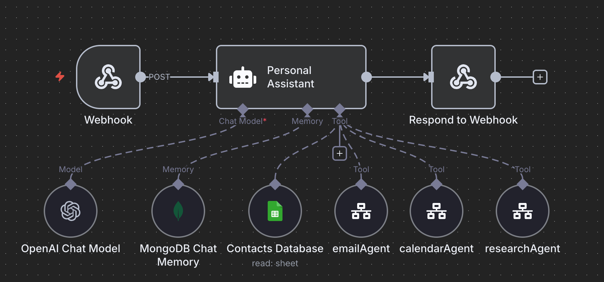
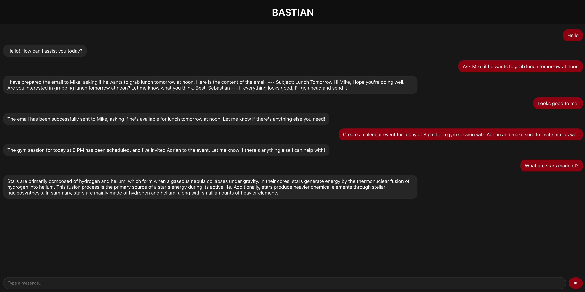

# AI Personal Assistant

An AI-powered personal assistant built with **React**, **Flask**, **MongoDB**, **n8n**, and **OpenAI**.  
This project enables natural language task automation, research, scheduling, and communication with persistent memory.

---

## Features

- **React Frontend**  
  - Chat-style interface with real-time updates  
  - Smooth auto-scrolling and user-friendly design  

- **Flask Backend**  
  - Provides RESTful `/api/message` endpoint  
  - Routes messages between frontend, n8n workflows, and AI model  

- **n8n Integration**  
  - Orchestrates workflows for research, scheduling, and emails  
  - Handles AI calls via OpenAI API inside n8n  
  - Connects to third-party services (calendar, email, contacts)  

- **OpenAI Model**  
  - Intelligent response generation  
  - Natural language understanding for commands and tasks  

- **MongoDB Chat Memory**  
  - Stores and retrieves user-specific conversation history  
  - Provides context-aware responses  

---

## Architecture



1. User sends a message from the React frontend.  
2. Flask backend forwards the request to n8n via a webhook.  
3. n8n processes the request using OpenAI, tools, and memory.  
4. Results are returned to Flask and displayed in the frontend chat.  

---

## Setup

### Prerequisites
- Node.js & npm  
- Python 3.x & pip  
- MongoDB instance  
- n8n running (cloud or self-hosted)  
- OpenAI API key  

### Installation

**Frontend (React):**
```bash
cd frontend
npm install
npm start
```

**Backend (Flask):**
```bash
cd backend
pip install -r requirements.txt
python app.py
```

### Configuration
- Update `N8N_URL` in `app.py` with your production webhook URL.  
- Configure your MongoDB connection string in n8n.  
- Add your OpenAI API key inside n8n workflows.  

---

## Usage

- Start the React app → open `http://localhost:3000`  
- Start the Flask backend → runs on `http://localhost:5000`  
- Chat with the assistant in real time  

- Try natural language commands like:  
  - “Schedule a meeting with John tomorrow at 3 PM”  
  - “Send an email to Sarah about the project update”  
  - “Research the latest AI frameworks”  

---

## Tech Stack
- **Frontend:** React, CSS  
- **Backend:** Flask, Python  
- **AI & Orchestration:** OpenAI, n8n  
- **Database:** MongoDB  
- **Integrations:** Google Contacts, Calendar, Email  